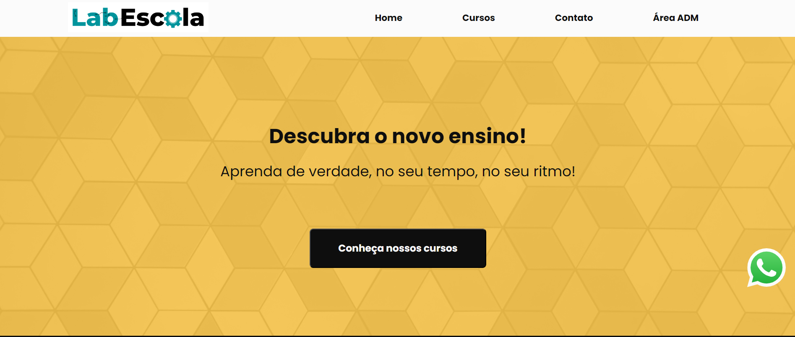
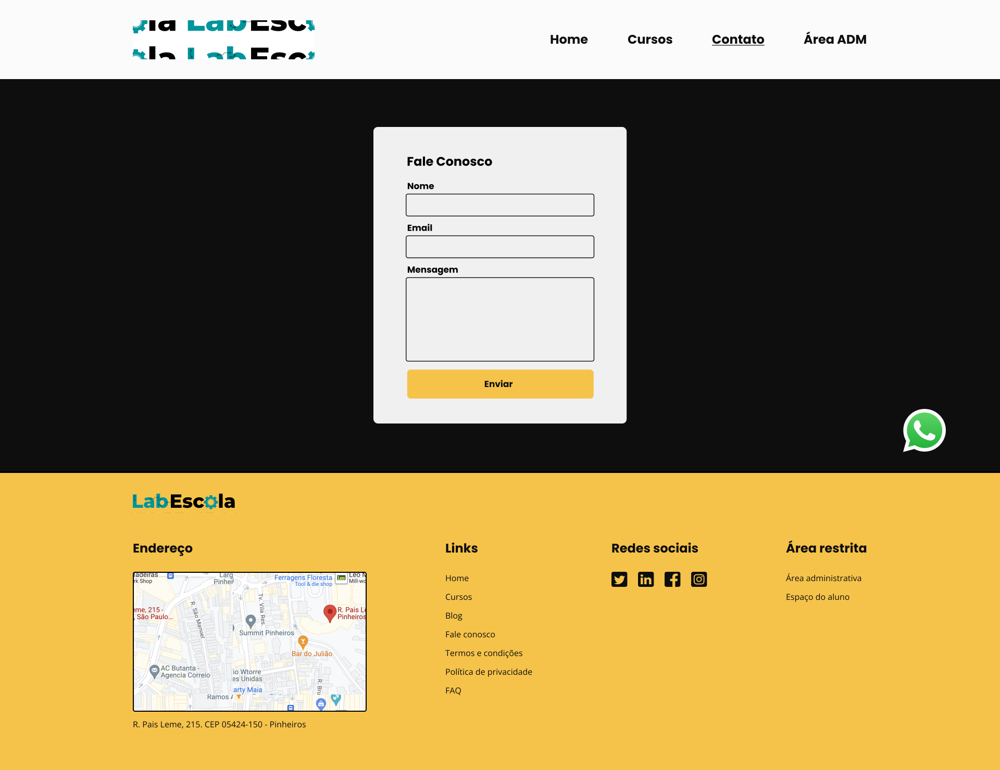
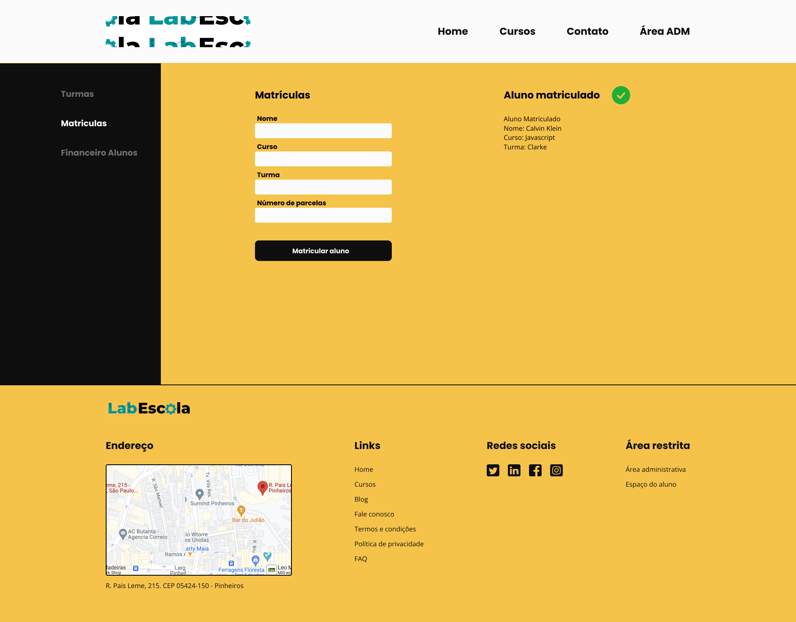
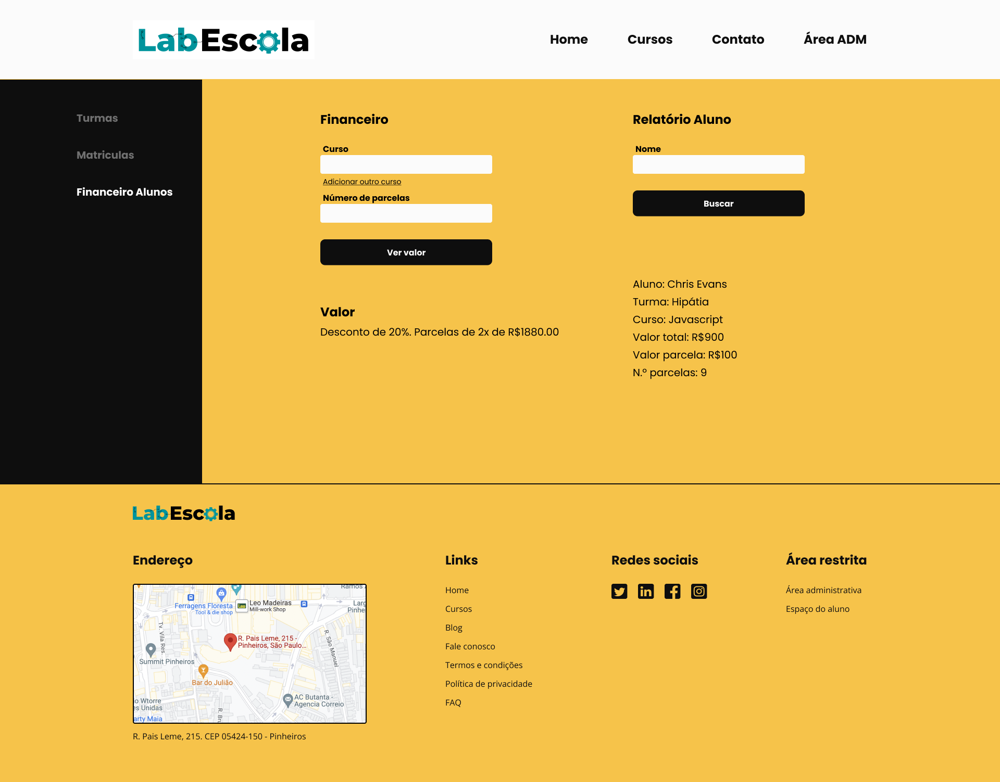

# Projeto Escola de Programação



O projeto frontend que consiste em um site para uma escola de programação, possuindo seis páginas distintass, no qual é possível visualizar os cursos disponíveis, fazer matrículas e consultas financeiras. 

## Índice
- <a href="#funcionalidades">Funcionalidades do projeto</a>
- <a href="#layout">Layout</a>
- <a href="#demonstração">Demonstração</a>
- <a href="#rodar">Como rodar o projeto</a>
- <a href="#tecnologias-utilizadas"> Tecnologias utilizadas</a>
- <a href="#autora">Pessoa autora</a>
- <a href="#proximos-passos">Próximos passos</a>

## Funcionalidades do projeto
 - [x] Página principal
 - [x] Página de cursos
 - [x] Página de contato
 - [x] Página de turmas da área administrativa
 - [x] Página de matrículas da área administrativa
 - [x] Página da parte financeira da área administrativa
 - [x] Pesquisar por uma turma ou visualizar todas as turmas
 - [x] Entrar em contato com a escola
 - [x] Matricular aluno
 - [x] Gerar relatório do aluno

## Layout







## Demonstração

[Link Demonstração (deploy)] (https://wakeful-substance.surge.sh/)

## Como rodar o projeto
```bash
# Clone este repositório
$ git clone linkrepo

# Acesse a pasta do projeto no seu terminal
$ cd projeto-intro-web-js

# Abra a aplicação usando o navegador de sua preferência
```

## Tecnologias utilizadas
1. HTML
2. CSS
3. DOM
4. Sweet Alert
5. Figma

## Pessoa autora 
[LinkedIn](https://www.linkedin.com/in/julia-silva-borges/)

## Próximos passos
 - [ ] Implementar responsividade do layout para vizualição em celulares
 - [ ] Melhorar a responsividade já existente para telas menores